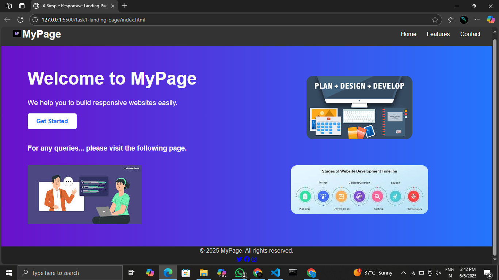

Responsive Landing Page

This project is a simple, clean, and responsive landing page built using only HTML and CSS. It includes a header, hero section, and footer, all designed to adapt gracefully to different screen sizes.

 Features

- Fully responsive layout
- Modern design with clean UI
- Header with navigation links
- Hero section with heading, description, and call-to-action button
- Footer with copyright info

Technologies Used

- HTML5
- CSS3 (Flexbox, Media Queries)

---
## 📸 Preview

 
